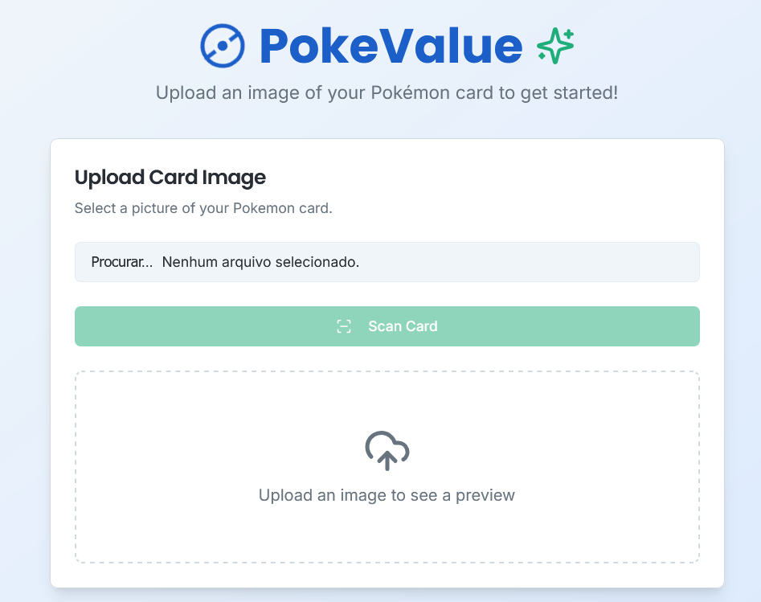
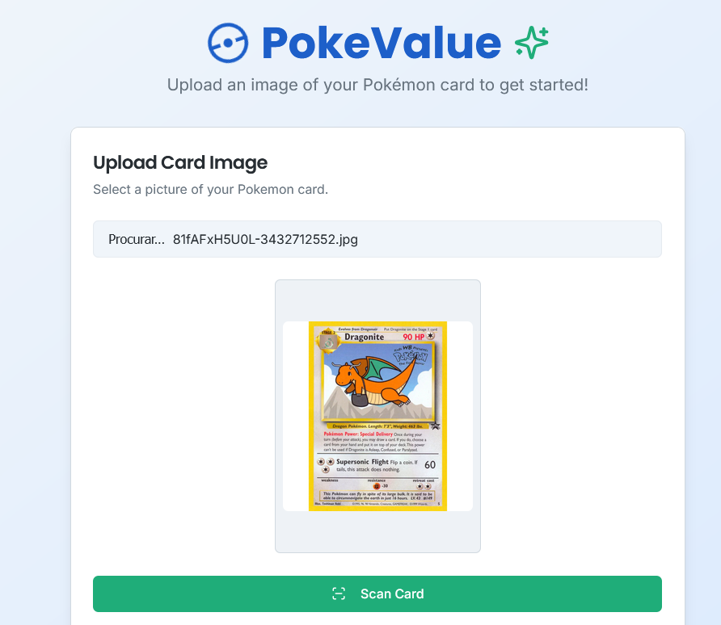
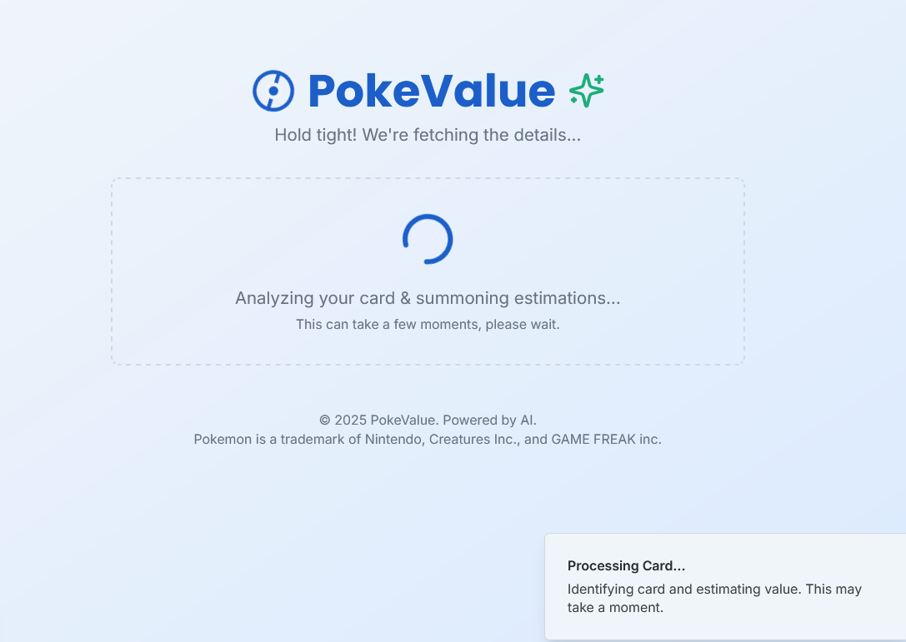
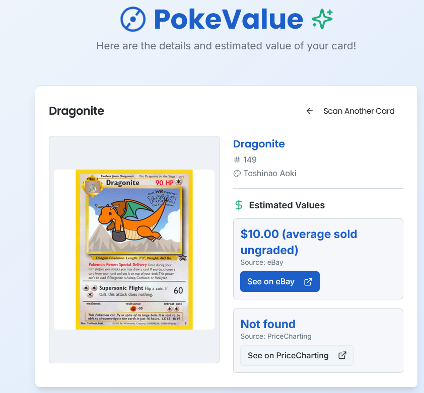

# Firebase Studio

This is a NextJS starter in Firebase Studio.

To get started, build the project and create the env file before serving it:

### Api key:

To use the Gemini API, you need to create an API Key in Google AI Studio:
https://aistudio.google.com/app/apikey

Then, create a .env file at the root of your project and add the following:
GOOGLE_API_KEY="YOUR_API_KEY_HERE"

Make sure to restart your development server after adding the .env file.

    
    
    
    

